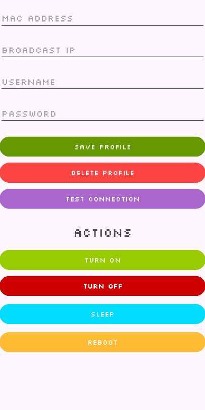

# 📱 PC Shutdown
Мобильное приложение для дистанционного упривления питанием компьютера.



## 🛠️ Сборка и установка

1. **Склонируйте репозиторий с GitHub на свой локальный компьютер.**
```
git clone https://github.com/JelezJZ/PC_Shutdown.git
```
2. **Откройте проект в Android Studio**
3. **Убедитесь, что у вас установлен Android SDK, Gradle и JDK 11+**
4. **Добавьте файл local.properties (если отсутствует):**
```
sdk.dir=/путь/до/вашего/Android/Sdk
```
5. **Соберите и запустите проект**

### 🛠️ Настройка приложения
1. **Добавьте компоненты: Клиент OpenSSH и Сервер OpenSSH в настройках компьютера.**
2. **Включить службу OpenSSH SSH Server.**
3. **В настройках BIOS включите настройку Wake-on-LAN.**
4. **Заполните строку Mac и ip адреса вашего компьютера.**
5. **Заполните строку с именем пользователя и паролем от учетной записи Microsoft.**
6. **Проверьте подключение к компьютеру, после успешного подключения сохраните профиль.**